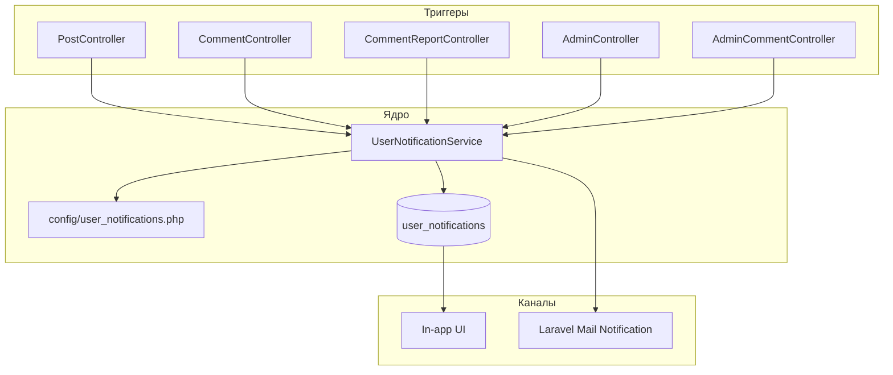

# Архитектура внутренних уведомлений

## Цель

Дополнить существующие **email-уведомления** (Laravel `Notification` + канал `mail`) слоем **in-app** уведомлений с колокольчиком, списком, прочитано/непрочитано и удалением.

## Существующая email-система

| Класс | Событие | Получатель |
|-------|---------|------------|
| `PostApprovedNotification` | Одобрение публикации | Автор |
| `PostRemovedByAdminNotification` | Отклонение / удаление публикации | Автор |
| `NewCommentNotification` | Новый комментарий к посту | Автор поста |
| `CommentRemovedByAdminNotification` | Удаление комментария модератором | Автор комментария |
| `UserBannedNotification` | Блокировка | Пользователь |
| `UserUnbannedNotification` | Разблокировка | Пользователь |
| `PostFavoritedNotification` | Избранное (вне списка in-app) | Автор поста |

Общие правила email: `email_notifications_enabled`, пустой `email` → письмо не уходит. Текст обжалования: `App\Support\MailAppeal`.

## Новая подсистема

### Таблица `user_notifications`

| Поле | Назначение |
|------|------------|
| `user_id` | Получатель |
| `type` | Код события (`UserNotificationType`) |
| `title` | Краткий заголовок в колокольчике |
| `body` | Развёрнутый текст (1–2 предложения) |
| `action_url` | Ссылка внутри сайта (`/post/5`, `/settings`) |
| `meta` | JSON: `post_id`, `comment_id`, `reason`, … |
| `email_sent` | Было ли отправлено письмо |
| `read_at` | Прочитано |
| `created_at` | Время |

Удаление пользователем — **жёсткое** (`DELETE`), без soft delete.

### API (`auth:sanctum`)

| Метод | Путь | Действие |
|-------|------|----------|
| GET | `/api/notifications` | Список (пагинация, `unread_only`) |
| GET | `/api/notifications/unread-count` | Счётчик для бейджа |
| POST | `/api/notifications/{id}/read` | Прочитать одно |
| POST | `/api/notifications/read-all` | Прочитать все |
| DELETE | `/api/notifications/{id}` | Удалить одно |
| DELETE | `/api/notifications` | Очистить все |

### UI (React)

- `NotificationsBell` в `Header` (только для авторизованных)
- `NotificationsModal`: список, отметка прочитанным, удаление, переход по `action_url`
- Под каждым пунктом при `email_sent`: *«Подробная информация направлена на вашу электронную почту.»*
- Опрос счётчика при фокусе вкладки / после действий

### Типы in-app уведомлений

| type | Триггер | Email |
|------|---------|-------|
| `post_pending_moderation` | Создание/повторная отправка на модерацию | Да (новое) |
| `post_approved` | `approvePost` | Да |
| `post_rejected` | `rejectPost`, автомодерация | Да |
| `post_deleted` | `deletePost` | Да |
| `post_restored` | `restorePost` | Да (новое) |
| `comment_published` | Успешная публикация комментария | Да (новое) |
| `comment_deleted` | Удаление модератором / пользователем | Да (при admin) |
| `comment_restored` | `restore` комментария | Да (новое) |
| `comment_on_your_post` | Новый комментарий | Да |
| `report_submitted` | Жалоба принята | Да (новое) |
| `report_reviewed` | Жалобы сняты / комментарий удалён | Да (новое) |
| `account_banned` | `banUser` | Да |
| `account_unbanned` | `unbanUser` | Да |
| `role_changed` | `POST admin/users/{id}/role` | Да (новое) |

### Единая точка отправки

`UserNotificationService::notify($user, $type, $replacements, $mailNotification?)`:

1. Строит `title`, `body`, `action_url` из конфига.
2. Создаёт запись в `user_notifications`.
3. При переданном `$mailNotification` и включённых email — `notify()` + `email_sent = true`.

Письма дополняются строкой `MailAppeal::supportLine()` (обращение в поддержку по адресу отправителя).
