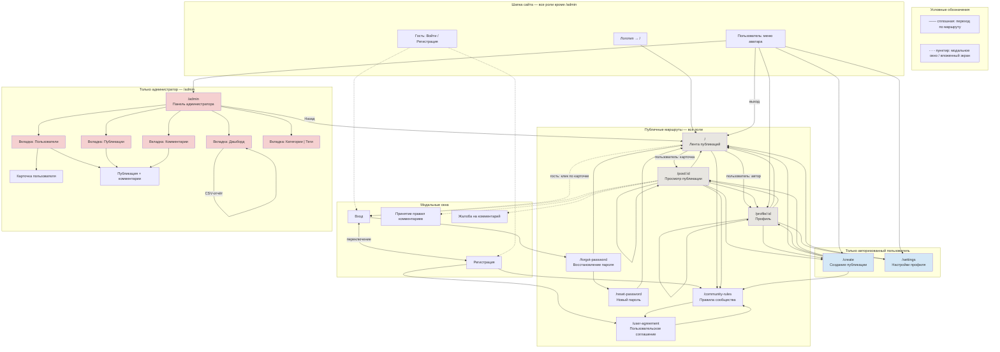

# Схема навигации веб-приложения «Цифровое искусство»

На одной диаграмме показаны экраны (маршруты React Router) и переходы для ролей **гость**, **пользователь** и **администратор**. Пунктир — модальные окна или вложенные состояния без отдельного URL.

## Доступ по ролям

| Маршрут / экран | Гость | Пользователь | Администратор |
|-----------------|:-----:|:------------:|:-------------:|
| `/` — лента | ✓ | ✓ | ✓ |
| `/post/:id` | ✓ (по URL; из ленты — через вход) | ✓ | ✓ |
| `/profile/:id` | ✓ (по URL; из ленты — через вход) | ✓ | ✓ |
| `/community-rules`, `/user-agreement` | ✓ | ✓ | ✓ |
| `/forgot-password`, `/reset-password` | ✓ | ✓ | ✓ |
| Модалки «Войти» / «Регистрация» | ✓ | — | — |
| `/create` | редирект на `/` | ✓ | ✓ |
| `/settings` | редирект на `/` | ✓ | ✓ |
| `/admin` | редирект на `/` | редирект на `/` | ✓ |

## Основные переходы по ролям

### Гость
- **Лента** — просмотр, поиск, фильтры, сортировка; без фильтра «Подписки».
- Из ленты клик по публикации или автору → **модалка «Войти»** (не переход).
- Прямой адрес `/post/:id`, `/profile/:id` — просмотр без лайков, комментариев, избранного, подписки.
- **Шапка:** «Войти», «Регистрация»; из регистрации — ссылки на правила и соглашение.
- **Восстановление пароля:** «Забыли пароль?» → `/forgot-password` → `/reset-password` → `/`.

### Пользователь
- Всё, что у гостя, плюс полная навигация из ленты (публикация, профиль, рекомендации).
- **Меню аватара:** свой профиль, «Добавить работу», «Настройки», «Выйти».
- **Профиль (свой):** вкладки портфолио, избранное, черновики, на модерации.
- **Публикация:** лайк, избранное, комментарии, жалоба (⋮), редактирование/удаление своей работы.
- **Создание** `/create` → после сохранения — профиль, публикация или лента.
- Фильтр ленты **«Только авторы, на которых подписан»** (в панели фильтров).

### Администратор
- Весь функционал пользователя на публичных страницах.
- **Панель** `/admin` (отдельная шапка): вкладки «Дашборд», «Пользователи», «Публикации», «Комментарии», «Категории | Теги».
- Внутри вкладок — детальный просмотр пользователя, публикации с комментариями (без смены URL).
- «Назад» из админки → главная лента; «Выйти» — выход из аккаунта.

## Вложенные состояния без отдельного URL

| Раздел | Состояние |
|--------|-----------|
| Лента | Панель фильтров (категория, теги, сортировка, подписки) |
| Публикация | Модалки: вход, правила комментариев, жалоба, редактирование/удаление (автор) |
| Админ → Пользователи | Список → карточка → публикации пользователя → деталь публикации |
| Админ → Публикации / Комментарии | Список → «Открыть публикацию» → экран публикации с комментариями |
| Админ → Дашборд | Модалка выбора периода для CSV-отчёта |
